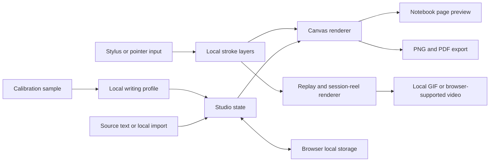

# PenFlow

> **A browser-first handwriting studio for turning source material into editable, study-ready notebook pages.**

[](https://react.dev/) [](https://www.typescriptlang.org/) [](https://vite.dev/)

| [Repository](https://github.com/vincenzo-afk/PenFlow) | [Report a bug](https://github.com/vincenzo-afk/PenFlow/issues/new?template=bug_report.yml) | [Request a feature](https://github.com/vincenzo-afk/PenFlow/issues/new?template=feature_request.yml) |
| --- | --- | --- |

## Table of contents

- [About](#about)
- [Architecture](#architecture)
- [Technology](#technology)
- [Getting started](#getting-started)
- [Usage](#usage)
- [Project structure](#project-structure)
- [Features and limitations](#features-and-limitations)
- [Testing and quality](#testing-and-quality)
- [Deployment](#deployment)
- [Contributing](#contributing)
- [Security](#security)
- [License](#license)
- [Acknowledgments](#acknowledgments)

---

## About

PenFlow converts typed or imported study material into rendered notebook pages and keeps the working document in the browser. A user can edit source text, select paper and pen characteristics, add correction marks, draw directly on a page with pointer input, calibrate a local visual writing profile, and export a static page, document, or replay.

The application is intentionally local-first. It stores notebooks, direct-ink layers, custom presets, and calibrated profiles in browser storage. OCR, animated GIF creation, and replay-video creation run in the browser. This makes the project suitable for study notes and handwriting workflows where material should stay on the device.

### Current capabilities

| Capability | Description |
| --- | --- |
| Handwriting and paper rendering | Six writing identities, ten paper stocks, six pen types, seeded variation, page pagination, and configurable ink, baseline, tremor, margin, binding, and correction details. |
| Direct ink | Pointer-aware pen, highlighter, and eraser input with stroke persistence, undo, clear, page compositing, and replay. |
| Calibration profiles | Guided sample capture derives editable traits such as pace, slant, scale, spacing, pressure, baseline movement, and tremor without creating a biometric identity. |
| Study workflow | Paste or import source material, shape it into concise revision blocks, import text or supported image files, and use in-browser OCR for readable image scans. |
| Exports | Download a page as PNG, all pages as PDF, an active-page replay as GIF or browser-supported MP4/WebM, or a multi-page session reel from at least two inked pages. |
| Local library | Save and reopen a limited local notebook library with paper, pen, humanization, annotation, and drawing settings. |

## Architecture



The React studio holds the editable note state. Canvas rendering composes paper, type-like handwriting, marks, and saved direct-ink layers. The same document model feeds static exports and deterministic replay frames, which are encoded locally as GIF or, where available, browser-recorded video.

---

## Technology

| Area | Technology verified in the repository |
| --- | --- |
| Front end | React `19.2.1`, TypeScript `5.6.3`, Vite `7.1.7`, Tailwind CSS `4.1.14` |
| UI primitives | Radix UI components, Lucide React, Sonner, Framer Motion |
| Rendering | Browser Canvas API and pointer events |
| Local export | `gifenc` `1.0.3`, browser `MediaRecorder` and `captureStream` when available |
| Production serving | Express `4.21.2` serving the built client with a SPA fallback |
| Package management | pnpm `10.4.1` as declared by `packageManager` |

---

## Getting started

### Prerequisites

Install Node.js and enable Corepack so the repository’s pnpm version can be used. The repository does not declare a Node.js `engines` range; use a Node.js release compatible with Vite `7.1.7`.

### Install and develop

```bash
git clone https://github.com/vincenzo-afk/PenFlow.git
cd PenFlow
corepack enable
pnpm install
pnpm dev
```

The development server starts with Vite and is available on the network interfaces exposed by `vite --host`.

### Validate a production build

```bash
pnpm check
pnpm build
pnpm start
```

`pnpm build` produces the client files under `dist/public` and bundles the Express server under `dist`. `pnpm start` serves the resulting application.

### Configuration

PenFlow’s core studio features do not require a local `.env` file. The runtime accepts two server variables:

| Variable | Required | Purpose |
| --- | --- | --- |
| `NODE_ENV` | No | When set to `production`, the Express server serves the production static path. |
| `PORT` | No | Overrides the server port; the server defaults to `3000`. |

The source tree also references `VITE_APP_ID`, `VITE_FRONTEND_FORGE_API_KEY`, `VITE_FRONTEND_FORGE_API_URL`, `VITE_OAUTH_PORTAL_URL`, `BUILT_IN_FORGE_API_KEY`, and `BUILT_IN_FORGE_API_URL` for a generated managed-runtime integration. They are not required for the local PenFlow studio workflow described above.

---

## Usage

Start with a source sheet, then use the studio controls to tune the page. A typical local workflow is:

1. Enter or import source material. Text, Markdown, and supported image files are accepted by the interface.
2. Select a pen, handwriting identity, humanization settings, and paper stock.
3. Add text marks or use direct ink to annotate the generated page.
4. Optionally write a calibration sample, review the live profile proof, then explicitly apply or save the style.
5. Export the current page, full PDF, direct-ink replay, or multi-page session reel.

For a session reel, draw on at least two different pages of a multi-page note. The exporter orders inked pages by page number and adds page transitions before creating a local GIF or browser-supported video file.

## Project structure

```text
PenFlow/
├── client/
│   ├── index.html                 # Browser entry document
│   └── src/
│       ├── components/            # Canvas, stylus, profile, and UI components
│       ├── contexts/              # Theme state
│       ├── lib/                   # Appearance, drawing, and replay-export logic
│       ├── pages/                 # Studio and not-found routes
│       ├── App.tsx                # Client routing and providers
│       └── main.tsx               # React entry point
├── server/index.ts                # Static production server and SPA fallback
├── shared/                        # Shared compatibility constants
├── .github/                       # CI, issue forms, and pull-request guidance
├── package.json                   # Scripts, dependency manifest, pnpm version
└── vite.config.ts                 # Vite, Tailwind, aliases, and build output
```

## Features and limitations

### Implemented

- ✅ Local handwriting, paper, correction, and direct-ink rendering.
- ✅ Local browser storage for notes, writing profiles, presets, and stroke layers.
- ✅ Browser-side OCR import, PDF/PNG export, replay GIF/video export, and multi-page reels.
- ✅ Live handwriting-profile proofs and side-by-side profile comparison before application.

### Current limitations

- The app has no account system or cross-device synchronization.
- Video replay exports depend on the browser supporting `MediaRecorder` and canvas stream capture; GIF export remains available through the local encoder.
- Calibrated profiles reproduce configurable visual traits, not exact personal letterforms or identity.
- The repository currently has no automated test suite; TypeScript checking and production builds are the available validation commands.

The repository history is available through [GitHub commits](https://github.com/vincenzo-afk/PenFlow/commits/main).

---

## Testing and quality

Run the two committed validation commands:

```bash
pnpm check
pnpm build
```

The included GitHub Actions workflow runs those same commands on pushes and pull requests targeting `main`. Vitest is present in the development dependencies, but no test command or committed automated test suite exists at this time.

---

## Deployment

The repository has no provider-specific deployment configuration. Create a production bundle, then start the bundled Express server:

```bash
pnpm install --frozen-lockfile
pnpm build
NODE_ENV=production PORT=3000 pnpm start
```

Deploy the resulting Node.js process to an environment that can serve HTTP traffic. The Express server serves the built client and returns the client entry for unmatched routes, preserving the single-page application routing model.

---

## Contributing

Please read [CONTRIBUTING.md](CONTRIBUTING.md) before opening a pull request. Contributions should keep the local-first privacy model intact and should include the relevant TypeScript, build, browser, mobile, and documentation checks.

## Security

For vulnerability reporting, follow [SECURITY.md](SECURITY.md) and avoid public issues. Do not include private handwriting samples, documents, profiles, or access credentials in issues, pull requests, or attachments.

## License

The package manifest declares `MIT`, but this repository does not yet contain a `LICENSE` file. License text and the copyright holder must be confirmed before relying on the repository’s licensing terms.

## Acknowledgments

PenFlow is built with React, TypeScript, Vite, Tailwind CSS, Radix UI, Lucide, Express, and gifenc. Its implementation also integrates browser canvas, local storage, pointer input, media-recording, and stream-capture capabilities where supported by the user’s browser.

---

Built and maintained in this repository by [vincenzo-afk](https://github.com/vincenzo-afk). [Back to top](#penflow)
